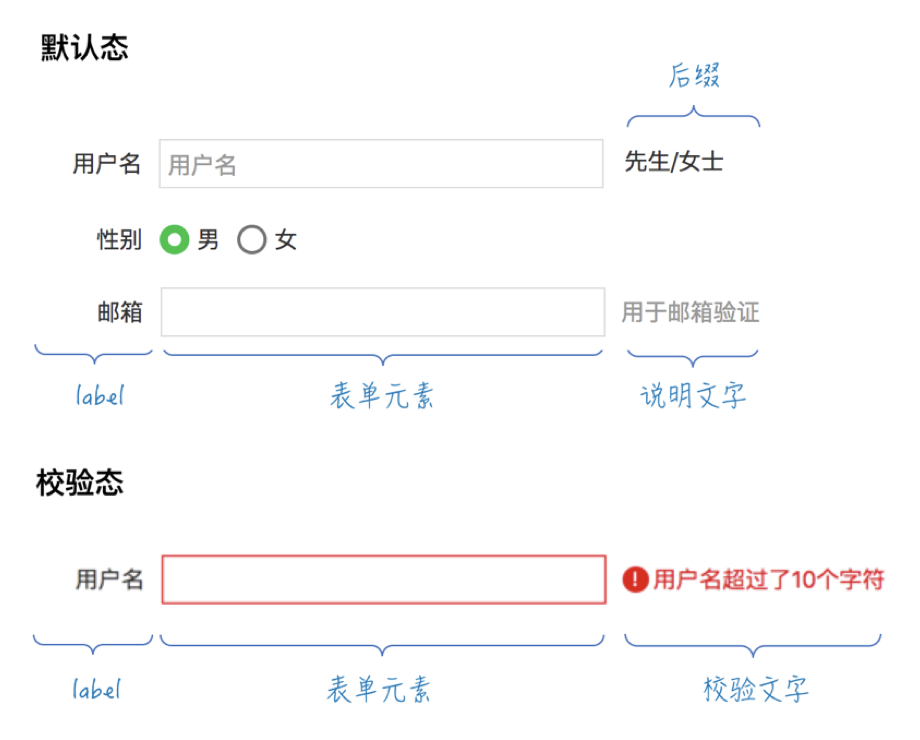
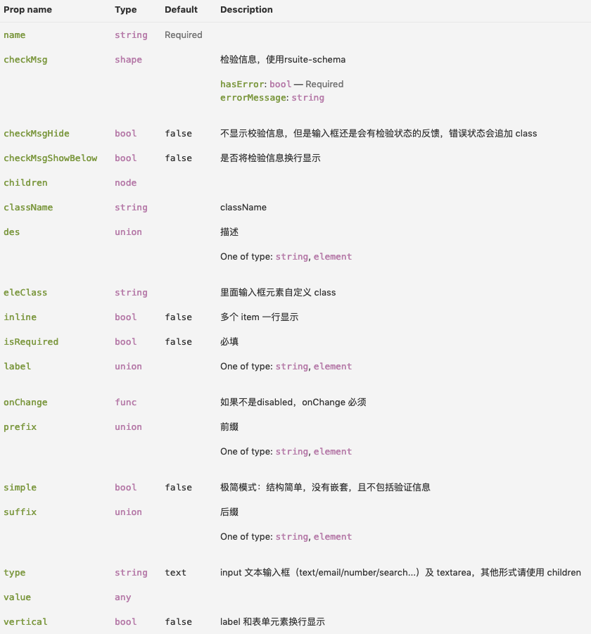

# Form 表单组件

该表单组件主要解决了 form 表单相关的3个问题：

- 各个元素如何排版布局
- 各个值的自动管理
- 表单验证（onChange 即时校验及提交的全部校验）

具体设计思想：[React form 表单组件的解决方案](https://imweb.io/topic/5ca03c119239213a22d7549d)

该组件主要提供了两个组件：

- 表单组件 `Form`，
- 表单项组件 `FormItem`，`FormItem` 可独立于 `Form` 组件使用，
- 基于表单项的高阶组件 `FormItemContext`，与表单组件 `Form` 配合使用。

Demo 可查看：

- [FormItem 组件 demo](https://codesandbox.io/embed/pmr1lyl81q?fontsize=14)
- [FormItemContext 组件与 Form 组件组合使用 demo](https://codesandbox.io/embed/j4nmm4p7kv?fontsize=14)

## 安装与引用

```bash
npm install react-form-next --save-dev
```

```js
import { Form, FormContext, FormItem } from "react-form-next";
// 默认不带样式，如果需要样式，请导入
import "react-form-next/index.css";
```

## FormItem 组件

首先，整个表单可以分为多个表单项。而一个表单项从结构上可能会涉及到 6 个部分：label、前缀、表单元素（或自定义的表单元素）、后缀、说明文字，校验态。大概如下图：



这样我们就可以根据这些封装成一个 `FormItem` 组件，其属性大概如下：



具体各个属性的设计可以查看上面的设计思想：[React form 表单组件的解决方案](https://imweb.io/topic/5ca03c119239213a22d7549d)

具体使用可看 [FormItem 组件 demo](https://codesandbox.io/embed/pmr1lyl81q?fontsize=14) 的源码

## Form 组件

`Form` 组件主要是使用 react 的 context 思想，将校验相关的三个属性`value`、`checkMsg`、`onChange` 通过 `Form` 组件传递给高级组件 `FormItemContext`。

而具体的检验将使用 [schema-typed](https://github.com/rsuite/schema-typed) 这个数据建模及数据验证工具。（该工具设计得非常赞，简直是眼前一亮，具体可以查看文档。）

注：context 使用了 react 16.3.x 引入的新的[context api](https://reactjs.org/docs/context.html)，使用之前请确保升级了 react 到 react 16.3.x 或以上。
